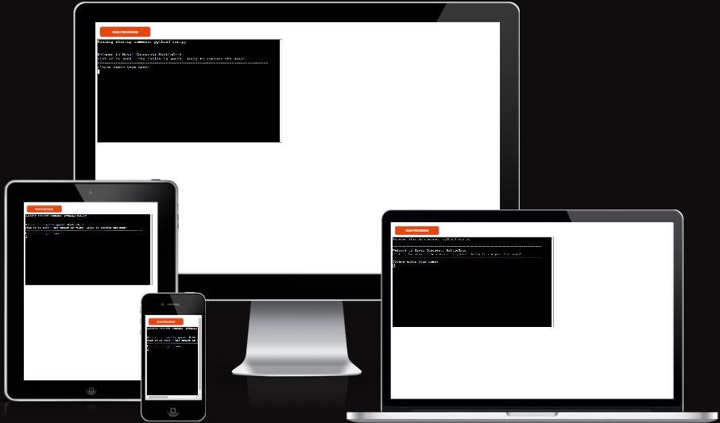
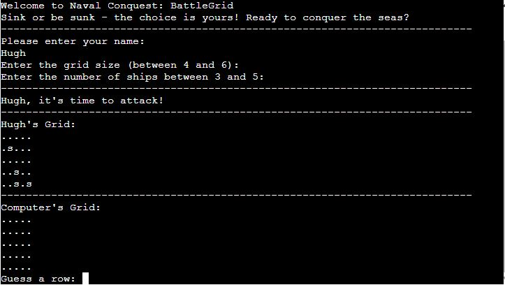
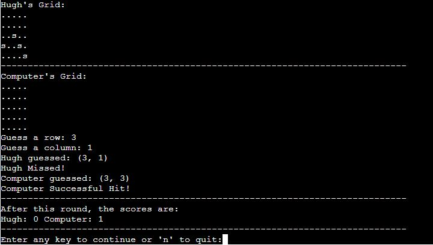
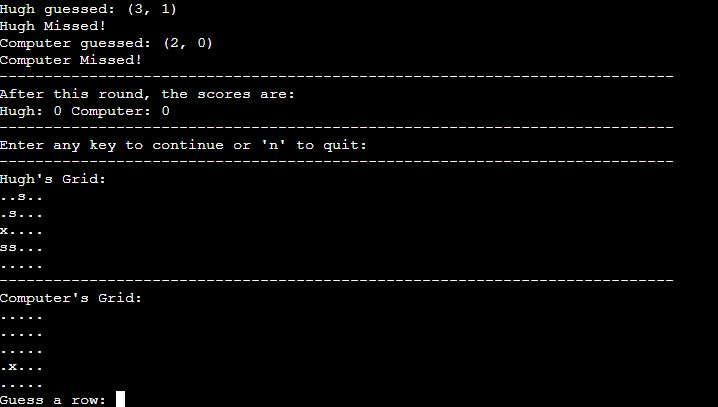
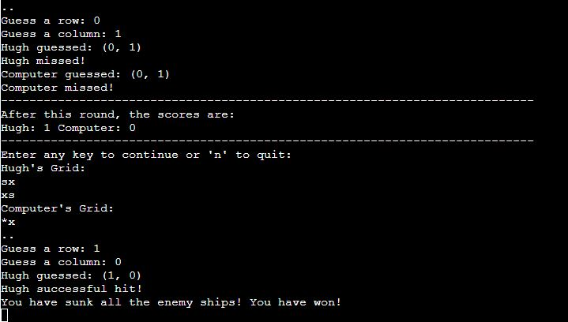
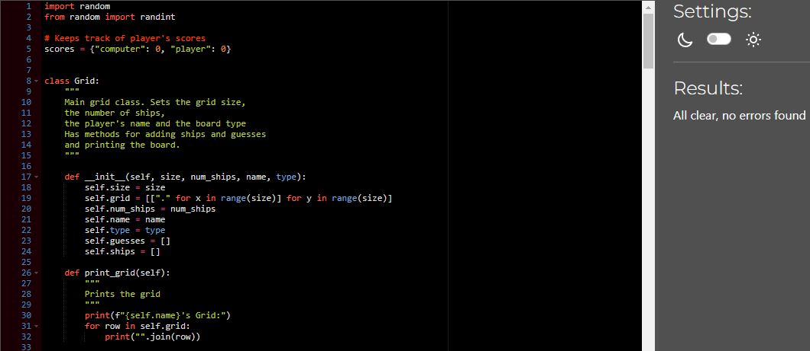

# Naval Conquest: BattleGrid
Naval Conquest: BattleGrid is a Python terminal game experience, accessible through Heroku.

The objective is for players to beat the computer by successfully sinking all of the computer's battleships before their own battleships are discovered. 

Each individual battleship is confined to a single square on the game board. 

[View the live version here](https://naval-conquest-30afa5133057.herokuapp.com/).

## How to Play

 - The player enters their name and two boards are randomly generated. 

 - The player can see the location of their battleships, indicated by an 's' for ship. 

 -  Instances of missed shots or inaccurate guesses are marked with 'x', whereas accurate hits are celebrated with '*'.

 - In a turn-based manner, players and the computer alternate, attempting to sink the others battleships.

 - Victory is achieved upon successfully sinking all of the opponents battleships.

 ## Features

- ### Difficulty Selection

  - Players can choose the game's difficulty. 
  - The default board dimensions are set at 5x5, accomodating 4 battleships.
  - Flexibility is integrated, enabling players to customize the grid size and the number of battleships. 
  - Each selection influences the game's difficulty and duration. 

- ### Random Board Generation 

  - The game employs a randomly generated board.
  - Ships are placed randomly on the board for both the player and the computer.
  - Players are presented with these boards before selecting their target coordinates. 
  - The computer's battleship positions are kept concealed from the player. 

 

- Gameplay

  - The player competes against the computer. 
  - The game accepts input from the player and keeps track of the score. 

- Player Input 

  - The player can input their desired coordinates by specifying the numbered row and column, both starting from 0.
  - Both the player's and computer's selected coordinates are displayed.
  - A message indicates whether the player or the computer has hit or missed a target.

- Scoring

  - Scores are updated and displayed after each round. 
  -  The score increments by 1 when a target is successfully hit. 

- Round Progression

  - Players can proceed to the next round by pressing any key.
  - Alternatively, they can exit the game by pressing 'n'. 

 

- Grid Display

  - Players are presented with updated grids prior to selecting new coordinates. 

- Hit Markings

  - Missed hits are indicated with an 'x', while succesful hits are marked with a '*'.

 

- End Game 

  - The game concludes when either the player or the computer successfully sinks all of the opponent's battleships. Depending on the outcome, a distinct message is presented to the user to indicate whether the computer or the player won.

 

### Remaining features to implement

- Player-Defined Ship Positions
 
  - Allow players to strategically position their ships before the game.

- Partial Battleship Damage

  - Allow ships to span multiple grid positions and sustain incremental damage, taking multiple guesses to sink one ship.

- Limited Guess Attempts

  - Players get a set number of tries to guess the computer's ship coordinates. Running out of attempts without sinking all ships leads to a loss.

## Data Model

- A Grid class was use as my model. I opted for Grid as opposed to Board, given the name of the game is Naval Conquest: BattleGrid. Two instances of a board are created, one for the player and one for the computer. 

- The Grid class stores the board size, the number of ships, player's name and the board type. 

- The class also has helper functions which are listed below. 

  - The 'print_grid' method prints the current board. 
  - The 'guess' method handle's the players guess and updates the board. 
  - The 'add_ship' method places the battleships on the x, y axis. 
  - The 'populate_grid' method places ships on the board. 

## Testing

 - I've given invalid inputs (strings, decimal number, same input twice) to ensure the player is prompted to enter the correct input. 
 - I confirmed the victory message shows correctly when all ships are sunk.
 - Tested in both my local terminal and Heroku. 

### Validator Testing

The code was passed thorugh a [PEP8 Linter](https://pep8ci.herokuapp.com/) and confirmed there are no errors found. 

### Bugs

#### Solved Bugs

 - While running the game, I encountered a KeyError related to the player's name input. I realized that this issue stemmed from mistakenly referencing the player type instead of the player_name variable.
 
 - I observed a problem when attempting to input a set of coordinates. The game incorrectly indicated that the coordinates had already been guessed by the player if they had been used by the computer before. This glitch was traced back to errors in the functionality of the valid_coordinates and player_input functions.

 - Additionally, the scores were not incrementing when the player or computer got a successful hit. I discovered this was due to a mismatch between the strings returned from the Grid class methods and the string used in the score updating logic. 

## Deployment

This project was deployed using Code Instiute's template for Heroku. To deploy, follow the below steps.

- Clone this repository
- Create a new Heroku app
- Set the buildpacks to Python and NodeJS in that order
- Set a config var for KEY : VALUE to PORT : 8000
- Link the Heroku app to the repository
- Click on 'Deploy'

## Techologies Used

 - ### Languages

   - Python
   - HTML5
   - JavaScript

 - ### Libraries and Programs

   - Git
   - Github
   - Codeanywhere
   - Heroku

## Credits

- To Code Institute for providing the deployment Terminal.
- The layout and structure of the game, including class and helper functions, as well as the new game function, draw inspiration from the sample Ultimate Battleship game.